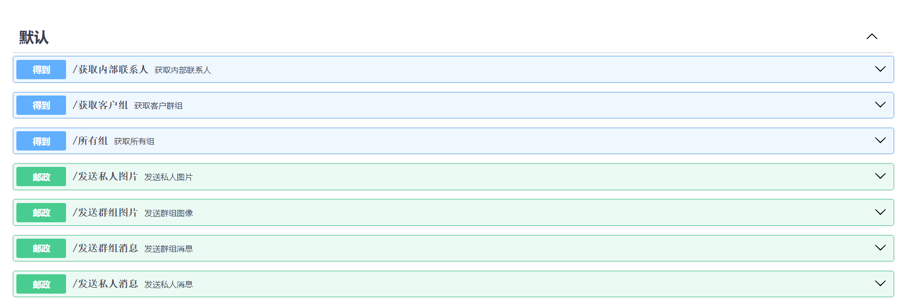
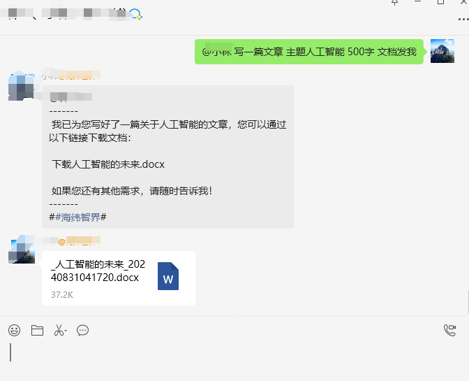
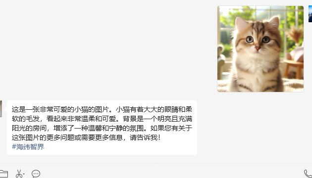

# Enterprise-WeChat-GPTbot- NextFlow-APP V1.0.08-beta.1

基于企业微信最新发布的 4.1.33.6009 版本，支持外部群的微信机器人语音功能私聊，并支持 FASTgpt。
- 企微版本，点击此处下载 [WeCom_4.1.33.6009.exe](https://dldir1.qq.com/wework/work_weixin/WeCom_4.1.33.6009.exe)

## 目录
- [更新日志](#更新日志)
- [新增功能说明](#新增功能说明)
- [演示图片](#演示图片)
- [快速开始](#快速开始)
- [企业微信机器人语音配置教程](#企业微信机器人语音配置教程)
- [语音配置教程](#语音配置教程)
- [视频教程](#🎥-新视频发布：情感与商业的融合-（详细视频教程）🎥)
- [功能详细说明](#功能详细说明)
- [企业微信机器人使用教程](#企业微信机器人使用教程)
- [图片识别文件解析功能](#图片识别文件解析功能)
## 联系我们

如需进一步交流和支持，欢迎扫描下方二维码添加微信进群：

<p align="center">
  
</p>


## 更新日志
## [V1.0.09-beta.1] - 2025-10-31

### 多模态与对象存储一体化
- ✅ 上传到 MinIO/阿里云 OSS
- ✅ 自动检测并设置正确的 Content-Type
- ✅ 生成公开访问 URL（便于外部/AI 访问）
- ✅ 将文件以多模态格式传递给 AI（包含文件名与 URL）
- ✅ 群聊中自动绕过 @ 检查（图片/文件自动触发处理）
- ✅ 支持所有常见文件类型（PDF / Office / TXT / ZIP 等）
- ✅ 自动检测文件 MIME 类型

### 多模态能力概览
1. 图片处理：从接收、上传到 AI 分析的完整链路
2. 文件处理：支持 PDF、Office、压缩包等多种格式
3. MinIO 集成：稳定可靠的对象存储方案
4. 智能触发：图片/文件自动处理，无需 @
5. 多模态 AI：文本、图片、文件组合请求
6. 工具完善：诊断、测试、修复配套工具
7. 文档完善：提供完整配置与使用指南

#### 配置项 (.env)
```makefile
# 通用
STORAGE_TYPE=minio                    # 存储类型：minio 或 oss

# MinIO（示例，可按需修改）
MINIO_ENDPOINT=minio.example.com       # MinIO 服务器地址（示例域名，勿填写真实 IP）
MINIO_PORT=9000                       # MinIO 端口
MINIO_USE_SSL=False                   # 是否使用 SSL
MINIO_ACCESS_KEY=minioadmin           # 访问密钥
MINIO_SECRET_KEY=minioadmin           # 密钥
MINIO_BUCKET=files                    # 存储桶名称
MINIO_PUBLIC_BASE_URL=https://minio.example.com   # 公开访问基础 URL（示例域名）

# 阿里云 OSS（当 STORAGE_TYPE=oss 时生效）
OSS_ENDPOINT=oss-cn-your-region.aliyuncs.com
OSS_ACCESS_KEY_ID=your_ak
OSS_ACCESS_KEY_SECRET=your_sk
OSS_BUCKET=files
OSS_PUBLIC_BASE_URL=https://your-bucket.oss-cn-your-region.aliyuncs.com
```

### 🎯 重大更新

#### 新增：图片和文件消息完整处理能力

企业微信机器人现已支持**图片**和**文件**（PDF、Word、Excel 等）的智能处理，实现从接收、存储到 AI 分析的完整链路。

---

### ✨ 新功能

#### 1. 📸 图片消息自动处理

- 自动识别：检测群聊中的图片消息
- 云端存储：上传到 MinIO/阿里云 OSS
- AI 分析：自动将图片 URL 传递给 AI 进行识别和分析
- 智能触发：图片消息无需 @ 机器人，自动处理

使用场景：
- 图片识别和描述
- 图表数据提取
- 文字识别（OCR）
- 物体检测

#### 2. 📄 文件消息智能处理

- 多格式支持：PDF、Word、Excel、PowerPoint、文本等 50+ 种文件格式
- 类型识别：自动检测文件 MIME 类型，正确设置 Content-Type
- 云端存储：上传到 MinIO 对象存储
- AI 分析：AI 可直接读取和分析文件内容
- 智能触发：文件消息无需 @ 机器人，自动处理

支持的文件类型：
```
文档：PDF, DOC, DOCX, TXT, MD
表格：XLS, XLSX, CSV
演示：PPT, PPTX
图片：JPG, PNG, GIF, WEBP
压缩：ZIP, RAR, 7Z
代码：PY, JS, TS, JAVA 等
```

#### 3. 💾 MinIO 对象存储集成

- 双后端支持：可切换使用 MinIO 或阿里云 OSS
- 自动初始化：首次使用自动创建 bucket
- 公开访问：自动设置 bucket 为公开读取，无需手动配置
- 智能类型检测：基于文件扩展名自动设置正确的 Content-Type
- URL 生成：生成标准化的公开访问 URL

配置项（示例）：
```env
STORAGE_TYPE=minio                    # 存储类型
MINIO_ENDPOINT=<YOUR_MINIO_ENDPOINT>  # 服务器地址
MINIO_PORT=<YOUR_MINIO_PORT>          # 端口
MINIO_BUCKET=files                    # Bucket 名称
```

#### 4. 🤖 AI 多模态能力

- 文本 + 图片：同时发送文字和图片给 AI
- 文本 + 文件：同时发送文字和文件给 AI
- 组合请求：支持文本、图片、文件任意组合

```

#### 5. 🎯 智能触发系统

群聊中的新行为：
- ✅ 发送图片 → 自动处理（无需 @）
- ✅ 发送文件 → 自动处理（无需 @）
- ✅ 发送文字 → 需要 @ 或触发词（保持原有逻辑）

技术实现：
- 提前检测消息是否包含图片/文件
- 自动绕过触发词检查
- 提供默认分析文本


---

### 📸 图片消息智能处理

#### 功能描述
机器人现在可以自动识别和处理群聊中的图片消息，无需用户 @ 提及。

#### 主要能力
- 自动识别图片：检测群聊中发送的图片消息
- 云端存储：自动上传图片到对象存储服务
- 智能分析：将图片传递给 AI 进行内容识别和分析
- 即时响应：AI 返回图片描述、内容提取等结果

#### 应用场景
- 图片内容识别和描述
- 图表数据提取
- 文字识别（OCR）
- 物体和场景检测
- 产品图片分析

---

### 📄 文件消息智能处理

#### 功能描述
支持 PDF、Word、Excel 等多种格式文件的自动处理和分析，无需用户 @ 提及。

#### 主要能力
- 多格式支持：支持 50+ 种文件格式
- 自动识别：检测群聊中发送的文件消息
- 类型检测：自动识别文件类型并正确处理
- 云端存储：上传文件到对象存储
- 内容分析：AI 自动读取和分析文件内容
- 即时反馈：返回文件摘要、关键信息提取等

#### 支持的文件类型
- 文档类：PDF、Word (DOC/DOCX)、TXT、Markdown
- 表格类：Excel (XLS/XLSX)、CSV
- 演示类：PowerPoint (PPT/PPTX)
- 图片类：JPG、PNG、GIF、WEBP、BMP
- 压缩类：ZIP、RAR、7Z
- 代码类：Python、JavaScript、Java、C++ 等

#### 应用场景
- 文档内容摘要
- 报告数据提取
- 合同条款分析
- 表格数据统计
- 代码审查建议

---

### 💾 云端存储服务

#### 功能描述
集成 MinIO 对象存储和阿里云 OSS，提供可靠的文件存储服务。

#### 主要能力
- 双后端支持：可在 MinIO 和阿里云 OSS 之间灵活切换
- 自动初始化：首次使用自动创建存储空间
- 公开访问：自动配置公开读取权限
- 智能管理：自动处理文件命名、去重、类型识别
- URL 生成：生成标准化的公开访问链接

#### 优势特点
- 高可靠性和可用性
- 快速上传和访问
- 灵活的存储策略
- 成本可控

---

### 🤖 AI 多模态分析

#### 功能描述
支持同时处理文本、图片、文件的组合请求，实现更强大的智能分析能力。

#### 主要能力
- 文本理解：理解用户的文字描述和问题
- 图片识别：分析图片内容、提取信息
- 文件解读：读取和理解各类文件内容
- 组合分析：综合文本、图片、文件进行全面分析
- 上下文关联：结合历史对话提供更准确的回答

#### 应用场景
- 图文结合："这张图表说明了什么？" + 图片
- 文件问答："总结这份报告的要点" + PDF
- 多元分析：同时发送图片和文档进行对比分析
- 数据提取：从图片或文件中提取结构化信息

---

### 🎯 智能触发系统

#### 功能描述
群聊中发送图片或文件时，机器人自动响应，无需额外操作。

#### 工作原理
- 自动检测：识别消息中的图片或文件
- 智能判断：自动绕过常规的 @ 或触发词要求
- 即时处理：立即开始上传和分析流程
- 保持兼容：纯文本消息仍需 @ 或触发词

#### 用户体验
| 消息类型 | 是否需要 @ | 处理方式 |
|---------|-----------|---------|
| 发送图片 | ❌ 不需要 | 自动处理 |
| 发送文件 | ❌ 不需要 | 自动处理 |
| 发送文字 | ✅ 需要 | @ 或触发词 |

---

### 🔄 自动化处理流程

#### 功能描述
完整的自动化处理链路，从接收到响应全程无需人工干预。

#### 处理流程
1. 消息接收：监听企业微信消息
2. 类型识别：判断是图片、文件还是文本
3. 文件获取：从企业微信下载或使用本地缓存
4. 云端上传：上传到对象存储服务
5. URL 生成：生成可访问的公开链接
6. AI 调用：将内容传递给 AI 分析
7. 结果返回：将 AI 的回复发送给用户

#### 特点
- 全程自动化
- 快速响应
- 容错处理
- 日志记录

---

### 🛠️ 管理和诊断工具

#### 功能描述
提供完整的测试、诊断和修复工具集，方便运维和故障排查。

#### 工具清单

##### 测试工具
- MinIO 连接测试：验证存储服务连接状态
- 图片上传测试：测试图片处理完整流程
- 文件上传测试：测试文件处理功能

##### 诊断工具
- PDF 文件诊断：检查文件完整性和访问权限
- 存储状态诊断：查看已上传文件列表和状态

##### 修复工具
- 权限修复：自动修复存储访问权限问题
- 文件重新上传：修复损坏或错误的文件
- 快速修复：一键修复常见问题

---

### 📊 功能对比

#### 更新前后对比

| 功能 | 更新前 | 更新后 |
|------|-------|-------|
| 图片处理 | ❌ 不支持 | ✅ 自动处理 |
| 文件处理 | ❌ 不支持 | ✅ 50+ 格式 |
| 触发方式 | @ 或触发词 | 图片/文件免 @ |
| AI 能力 | 纯文本 | 多模态 |
| 存储方式 | 本地 | 云端 MinIO/OSS |
| 管理工具 | 无 | 6 个工具 |

---

### 🎁 附加增强

#### 其他改进
- 错误处理优化：更完善的异常捕获和日志记录
- 性能提升：优化上传和处理速度
- 兼容性增强：支持更多文件格式和场景
- 文档完善：详细的配置指南和使用说明
- 代码质量：0 Linter 错误，完整注释

---

### 📈 应用价值

#### 业务价值
- 提升效率：自动处理图片和文件，节省时间
- 增强体验：无需 @，使用更自然
- 扩展能力：支持更丰富的交互方式
- 降低门槛：用户无需学习特殊操作

#### 技术价值
- 架构优化：模块化设计，易于扩展
- 可靠性高：完善的错误处理和恢复机制
- 可维护性：丰富的工具和文档
- 可扩展性：支持多种存储后端

## [V1.0.08-beta.1] - 2025-03-14

版本迭代4133版本
修复低版本
图片识别
图知识库发送图


## [V1.0.07-beta.1] - 2025-03-14

# NextFlow-APP V1.0.07-beta.1 更新说明
更新详情请参考：[更新说明]([https://github.com/luolin-ai/Enterprise-WeChat-GPTbot))  


## 主要更新：
- 修复无法发送签名图片
- 修复返回为空的回复
- 优化 [http://127.0.0.1:8001/docs](http://127.0.0.1:8001/docs) 文档
- 修复部分 API 无法使用
- 新增文件发送群组 API，也可私发文件
- 兼容 [https://nextflow.app/](https://nextflow.app/) 新请求格式，可在 https://nextflow.app/ 中管理企业微信的消息对应用户昵称 ID

-- 修复回复两次问题


- 优化广告小尾巴格式


## [v0.0.06] - 2024-10-30

### 新增功能
修复原有回复2遍
新增文件识别解析
修复原有bug问题
#### 新增功能
- **API 接口: 获取群成员列表**

- **API 接口: 获取内部联系人**
    - 添加了 `GET /get_internal_contacts` 接口，用于获取内部联系人列表。

- **API 接口: 获取客户群组**
    - 添加了 `GET /get_customer_groups` 接口，用于获取客户群组信息。

- **API 接口: 获取所有群组**
    - 添加了 `GET /all-groups` 接口，支持分页和批量获取所有群组信息。

- **API 接口: 发送私人图片**
    - 添加了 `POST /send-private-image` 接口，允许向指定的多个好友发送图片。

- **API 接口: 发送群组图片**
    - 添加了 `POST /send-group-image` 接口，允许向指定的多个群组发送图片。

- **API 接口: 发送群组消息**
    - 添加了 `POST /send-group-message` 接口，支持向群组发送消息，并支持@提及用户或@所有人。

- **API 接口: 发送私人消息**
    - 添加了 `POST /send-private-message` 接口，允许向指定的好友或多个好友发送消息。
      api地址：http://127.0.0.1:8001/docs#
      

**完整的 API 文档和使用指南请参考项目的 [API 文档](链接到API文档)。**

#### 2024年8月31日
- 新增文件发送功能
- 新增图片发送功能
- 基于 Fastgpt 插件实现可视化的调用
-
## 演示图片

| 文件发送示例 | 图片发送示例 |
|:------------:|:------------:|
|  |  |

#### 2024年8月27日
- 修复音频回复（目前仅支持私聊）

#### 2024年7月6日
- 版本更新至 4 月 24 日企微发布的新版本，点击此处下载 [WeCom_4.1.22.6009.exe](https://dldir1.qq.com/wework/work_weixin/WeCom_4.1.22.6009.exe)
- 修复部分回复消息的 Bug

#### 2024年5月8日
- 新增本地私有 Fastgpt 部署环境，可在本地运行企业微信和 Fastgpt
- 添加或更新 `USE_LOCAL_API` 变量（线上设置为 False，本地设置为 True）
- 新增兼容新版 FastAPI 调用功能
- 新增上下数据关联持久化，防止数据库文件误删导致关联上下文丢失

### 图片识别文件解析功能
### 功能介绍
- 图片识别：支持解析上传的图片文件内容。
- 文件解析插件：需自行设置解析的插件，以确保图片文件能够正确解析。
  
### 🌟 更新亮点
- **智能回复优化**：改进了 AI 算法，使机器人更准确地理解并回应用户问题。
- **增强的白名单功能**：支持灵活设置群聊和私聊的白名单。
- **聊天记录功能**：新增自动记录聊天内容到文件的功能。
- **用户界面改进**：对界面进行了微调以提升用户体验。
- **性能提升**：优化代码，提升机器人响应速度和稳定性。
- **支持私聊语音功能**：结合知识库定制专属领域企业微信语音数字分身，未来计划实现基于真人声音的实时对话功能。

## 快速开始

### 获取 AIWIS-KnowAi API 密钥的步骤

1. **访问 AIWIS-KnowAi 网站**：
    - 打开浏览器并访问 [AIWIS-KnowAi 网站](https://ai.aiwis.cn)。
2. **登录或注册账号**：
    - 如果已有账号，使用凭证登录；否则，注册一个新账号。
3. **创建或打开应用**：
    - 登录后选择已有应用或点击“创建新应用”并完成创建。
4. **获取 API 密钥**：
    - 在应用的配置页面找到“API 访问”部分，复制 AIWIS_KEY。
5. **配置项目**：
    - 打开企业微信机器人项目文件夹，找到并打开 `.env` 文件，将 `AIWIS_KEY` 值粘贴到以下行：
   ```makefile
   AIWIS_KEY=粘贴您的AIWIS_KEY
   ```
6. **运行机器人**：
    - 双击 `newqi24.exe` 文件运行机器人。
7. **测试机器人**：
    - 在企业微信中向机器人发送消息，验证其响应和语音功能。

## 企业微信机器人语音配置教程

### 🎙️ 语音功能环境变量设置

1. **打开电脑设置**：
    - 进入 **系统信息** > **高级系统设置** > **环境变量**。
2. **保留项目的 `ffmpeg` 文件**：
    - 确保项目中的 `ffmpeg` 文件夹存在，因为它是语音功能的关键组件。
3. **将 `ffmpeg` 路径添加到环境变量**：
    - 将以下路径添加到系统的 `Path` 变量中：
   ```
   I:\XX\XX\Enterprise-WeChat-GPTbot\ffmpeg\bin
   ```
4. **图片参考**：
   <div style="display: flex; justify-content: space-around;">
       
       
       
   </div>
## 联系我们

如需进一步交流和支持，欢迎扫描下方二维码添加微信进群：

<p align="center">
  
</p>

## 语音配置教程

### 1. 获取 AIWIS-KnowAi 语音 API 密钥

- 访问 [AIWIS-KnowAi API](https://nextflow.app/)。
- 登录或注册账号。
- 获取 `AIWIS_speech_KEY` 并在 `.env` 文件中添加以下内容：

```makefile
AIWIS_API_URL=你的代理地址
AIWIS_speech_KEY=粘贴您的AIWIS_speech_KEY
```

### 2. 配置语音模型

AIWIS-KnowAi 提供两种 TTS 模型：

- `tts-1`
- `tts-1-hd`

在 `.env` 文件中选择所需的模型：

```makefile
TTS_MODEL=tts-1  # 或者 tts-1-hd
```


# 🎥 新视频发布：情感与商业的融合 （详细视频教程）🎥

[](https://www.youtube.com/watch?v=5lk6WLmUk7Y)

**欢迎观看我们的最新YouTube视频！** 在这个视频中，我们将深入探讨如何将前沿的Fastgpt知识库与企业微信机器人技术结合起来，创造独特的语音数字分身和高效能的企业级语音助理。

## 🌟 视频亮点：

### 🤖 【个性化语音数字分身】
探索Fastgpt的高级算法，了解如何打造出一个能理解和响应您情感需求的虚拟伴侣。

### 💼 【企业级语音助理】
发现企微技术如何在您的业务中提供智能化、定制化的客户服务和数据管理。

### 📈 【案例研究】
通过真实案例，看看这些技术如何帮助不同行业的企业优化运营和提升客户满意度。

## 🚀 立即观看
别错过这一集精彩内容！点击下方链接，加入我们的旅程，探索科技如何在情感和商业领域创造奇迹。➡️ [观看视频](https://www.youtube.com/watch?v=5lk6WLmUk7Y)

## 企业微信机器人使用教程
~~1. 打开项目下载最新企业微信发布的的4.1.13.6002版本 下载：https://dldir1.qq.com/wework/work_weixin/WeCom_4.1.13.6002.exe~~

## 开始
2. 配置，
   打开 https://nextflow.app/ 网站，点击创建ai
   
   进入网站点击新建应用，点击生成key
   
   部分网站
   

### 功能详细说明
#### 智能回复
AI驱动的交互：利用AI技术（如AIWIS API）自动生成回复，支持自然语言理解。
上下文感知：能够根据之前的交互历史来生成更相关和个性化的回复。

#### 聊天记录
- 实时记录：所有群聊和私聊的消息都会被实时记录到文件中。
- 数据格式：消息记录以CSV格式保存，包含群ID/用户ID、群名称/用户名、消息内容和时间戳等信息。
- 记录管理：记录文件按日期组织，方便管理和检索。

#### 白名单功能
- 群聊白名单 (GROUP_CHAT_WHITELIST)：特定群组的成员可以享有更高的每日互动次数限制。
- 私聊白名单 (PRIVATE_CHAT_WHITELIST)：特定用户在私聊中可以享有更高的互动次数或无限制。

#### 互动次数限制
- 默认限制：普通用户在群聊

...

